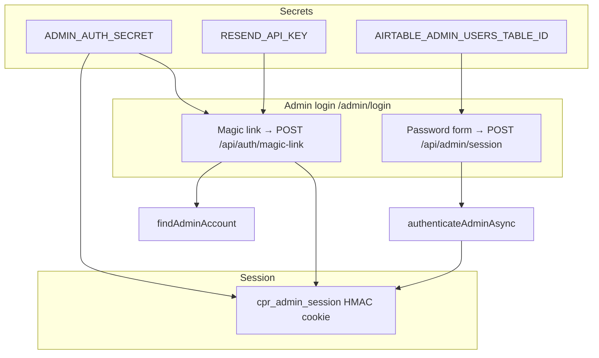

# CPR Authentication Report

**Date:** June 2026  
**Platform:** CPR Global (`cpr-site`)  
**Production:** https://canadianprospectrecruitment.vercel.app

---

## Why login kept failing (root causes)

Multiple partial fixes stacked on top of each other without addressing the full auth contract:

| # | Root cause | Impact |
|---|------------|--------|
| 1 | **Password login UI removed** from `/admin/login` while recovery docs still said "sign in with temp password" | Mike could set a password in Airtable but had **no password field** on the login page |
| 2 | **Password reset required Airtable token fields** (`Password Reset Token` / `Expires`) before sending email | Reset failed when Admin Users table was missing or fields not created — showed generic "not configured" |
| 3 | **Readiness check conflated** "magic-link login" with "password reset persistence" | System Readiness failed even when email login could work |
| 4 | **Fragmented auth paths** — magic link, password POST, Clerk (legacy PortalLogin), env legacy, Airtable users | Ops couldn't tell which path Mike should use |
| 5 | **Missing Vercel env vars** (`ADMIN_AUTH_SECRET`, `RESEND_API_KEY`, `AIRTABLE_ADMIN_USERS_TABLE_ID`) | Silent failures at runtime |

---

## Current architecture (after recovery)



**Portal (athlete/parent):** Magic link at `/portal/login` + legacy password reset via Notes field in Athlete Intake table.

---

## Files changed (this recovery)

| File | Change |
|------|--------|
| `lib/auth-config.ts` | Single readiness source; exact blocker messages |
| `lib/admin-password-reset-token.ts` | Stateless HMAC reset tokens (no Airtable storage) |
| `lib/admin-auth.ts` | Reset request/complete uses stateless tokens |
| `app/admin/login/page.tsx` | **Password form restored** + magic link |
| `app/components/auth/AdminPasswordLoginForm.tsx` | Password login component |
| `app/admin/forgot-password/page.tsx` | Actionable config errors + magic-link fallback |
| `app/api/admin/password-reset/request/route.ts` | Specific error codes |
| `app/api/admin/recovery/route.ts` | Emergency owner recovery API |
| `lib/system-checks.ts` | Separate magic-link vs password-reset checks |
| `.env.example` | EMERGENCY_RECOVERY_KEY documented |

---

## Required Vercel Production variables

| Variable | Required for | Mike login |
|----------|--------------|------------|
| `ADMIN_AUTH_SECRET` | Sessions, magic links, reset tokens | **Yes** |
| `ADMIN_EMAIL` | Mike's admin identity (env fallback) | **Yes** |
| `ADMIN_PASSWORD` | Legacy password login fallback | Optional if Airtable hash set |
| `RESEND_API_KEY` | Email login links + reset emails | **Yes** (magic link) |
| `RESEND_FROM_EMAIL` | Verified sender | **Yes** |
| `AIRTABLE_TOKEN` | Admin user storage | **Yes** (password save) |
| `AIRTABLE_ADMIN_USERS_TABLE_ID` | Persist password changes | **Yes** (password reset) |
| `PORTAL_SECRET` | Athlete/parent portal | For portal only |
| `EMERGENCY_RECOVERY_KEY` | One-time lockout recovery | Optional |

---

## Immediate steps for Mike

### Option A — Magic link (fastest, no password)

1. Go to `/admin/login`
2. Use **Email me a login link** with `mikecprglobal@mississaugamagic.com`
3. Open email within 15 minutes → tap Sign in

Requires: `ADMIN_AUTH_SECRET`, `RESEND_API_KEY`, `ADMIN_EMAIL` or Airtable admin row.

### Option B — Password login

1. Ensure `AIRTABLE_ADMIN_USERS_TABLE_ID` + `AIRTABLE_TOKEN` on Vercel
2. Run emergency recovery (once) or use another admin to set temp password
3. Go to `/admin/login` → **Sign in with password**

### Option C — Emergency recovery (locked out completely)

```bash
curl -X POST "https://canadianprospectrecruitment.vercel.app/api/admin/recovery" \
  -H "Content-Type: application/json" \
  -H "x-recovery-key: YOUR_EMERGENCY_RECOVERY_KEY" \
  -d '{"email":"mikecprglobal@mississaugamagic.com","tempPassword":"YourNewSecurePass1!","name":"Mike"}'
```

Then sign in at `/admin/login` with email + password.

---

## Production test checklist

- [ ] `/admin/login` shows password form **and** magic link
- [ ] Magic link email arrives and completes login
- [ ] Password login works with Airtable-stored hash
- [ ] Forgot password sends email with working reset link
- [ ] Reset link saves new password to Airtable
- [ ] Logout clears session
- [ ] `/portal/login` magic link works for test athlete/parent
- [ ] System Readiness shows green for Magic-link login

---

## Security recommendations

1. Set dedicated `ADMIN_AUTH_SECRET` (do not reuse `ADMIN_PASSWORD` long-term)
2. Remove `EMERGENCY_RECOVERY_KEY` from Vercel after Mike is in
3. Migrate fully to Airtable Admin Users table; retire `ADMIN_PASSWORD` env
4. Keep magic link as primary; password as backup for Mike

---

## Remaining issues

- Clerk-based `PortalLogin.tsx` still exists for white-label portals — separate from CPR admin login
- Portal magic link requires athlete/parent password hash on intake record (by design)
- `www` canonical URL — verify apex URL in `NEXT_PUBLIC_SITE_URL`
